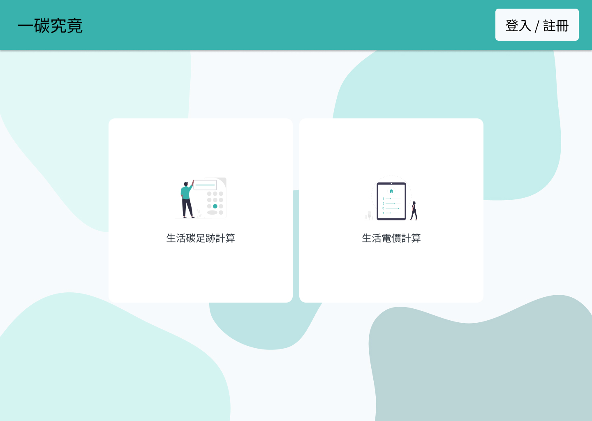

<a href="http://www.djangoproject.com/"></a>      [](https://opensource.org/licenses/Apache-2.0)
# :atom:Welcom to the Carbon Quest page! 一碳究竟:eyes:
<p align="center">
  
</p>


This project is licensed under the terms of the []([https://opensource.org/licenses/MIT](https://github.com/Polly7357/ai-proj/blob/master/LICENSE))


## Contributing:seedling:
We welcome contributions to this project. To contribute, follow these guidelines:

1. Fork the project repository.
2. Create a new branch for your contribution.
3. Make your changes and commit them.
4. Submit a pull request, explaining the purpose of your changes.


**Changelog**
---
**Version 1.3.0（2023/09/25）**
- Fixed front-end CDE post pre-defined formation
- Exception handling if front-end sent empty request

**Version 1.2.0（2023/09/23）
- Fixed front-end elec-device post pre-defined formation

**Version 1.1.0 (2023/09/21)**

- Fixed Database migration

**Version 1.0.0 (2023/09/20)**
-IoT info visualization on production

**Version 0.9 （2023/09/18）
- Prograssive Rate Calculation for Total Bill Amount and for Usage on production


## Key Features: ##
### 1. Electricity Usage Estimation:zap:

&nbsp;&nbsp;&nbsp;&nbsp;This section allows users to input information about their household appliances and calculates daily electricity consumption, monthly electricity usage, and estimates electricity costs based on different pricing structures.

#### &nbsp; 1.1. Input Household Appliances  
&nbsp;&nbsp;&nbsp;&nbsp;Users can input details about their household appliances, including power consumption in watts (W) and daily usage hours.

#### &nbsp; 1.2. Daily and Monthly Electricity Consumption
&nbsp;&nbsp;&nbsp;&nbsp;The function calculates the daily and monthly electricity consumption based on the user's input.

#### &nbsp; 1.3. Time-of-Use Pricing Estimates
- **Two-Tier Pricing**: Calculate estimated electricity costs based on a two-tier pricing structure.
- **Three-Tier Pricing**: Calculate estimated electricity costs based on a three-tier pricing structure.
- **Two-Tier Summer Pricing**: Calculate estimated electricity costs based on a two-tier pricing structure for the summer season.
- **Three-Tier Summer Pricing**: Calculate estimated electricity costs based on a three-tier pricing structure for the summer season.

 #### &nbsp; 1.4. Progressive Pricing Estimates
- **Input Bill Expense**: Users can input their electricity bill amount to understand their monthly electricity consumption.
 ```js
 /api/power/accu_usage/?total_expense=xxx
```

| Parameter | Type     | Description                       |
| :-------- | :------- | :-------------------------------- |
| `total_expense`      | `string` | **Required**. total_expense of electricity bill |

- **Input desired electricity usage**: Users can input their electricity usage to estimate their electricity costs.
```js
 /api/power/accu_cost/?usage=xxx
```

| Parameter | Type     | Description                       |
| :-------- | :------- | :-------------------------------- |
| `usage`      | `string` | **Required**. Desired electricity consumption |

#### &nbsp; 1.5. Energy Saving Recommendations:chart_with_upwards_trend:

&nbsp;&nbsp;&nbsp;&nbsp; Provide energy-saving recommendations based on the user's electricity usage and pricing options. These recommendations can help users evaluate the best pricing structure for their needs.</li>


### 2. Carbon Footprint Estimation:footprints:

&nbsp;&nbsp;&nbsp;&nbsp; 
This section allows users to input information about their daily consumption of various goods and services (food, clothing, housing, transportation) to estimate their carbon footprint (CDE - Carbon Dioxide Equivalent).

### 3. Management of Tariff Tables

&nbsp;&nbsp;&nbsp;&nbsp;This section helps Admins to manage electricity tariff tables and time-of-use rates.

#### &nbsp; 3.1. Electricity Tariff Table Management
- Admin can add, edit, or delete tariff tables.
- Each tariff table includes information about pricing tiers, peak/off-peak hours, and seasonal rates (if applicable).

#### &nbsp; 3.2. Time-of-Use Rate Management
- Admin can manage different time-of-use rate schedules, including regular and seasonal rates.

### 4. Real-Time AIoT Data Collection

&nbsp;&nbsp;&nbsp;&nbsp; This section discusses the real-time collection of AIoT (Artificial Intelligence of Things) data related to electricity usage.

>#### &nbsp; 4.1. AIoT Sensors
&nbsp;&nbsp;&nbsp;&nbsp; Currently, there are two sets of smart plugs placed in the homes of two different team members. 

>#### &nbsp; 4.2. Data Collection Frequency
&nbsp;&nbsp;&nbsp;&nbsp; information collects hourly

>#### 4.3. Data Storage
&nbsp;&nbsp;&nbsp;&nbsp; Google Cloud Platform sorage

## 5. Installation Manuel:page_with_curl:
  ### &nbsp; 5.1. Minimum Installation Requirements

&nbsp;&nbsp;&nbsp;&nbsp; Before running this project, please ensure that your computer meets the following minimum installation requirements:

- **Operating System:** Windows 10, macOS Big Sur, or Ubuntu 20.04 LTS (or higher).
- **Processor:** Intel Core i5 or higher.
- **Memory (RAM):** 8GB or more.
- **Storage Space:** At least 20GB of available space.
- **Python Version:** Python 3.7+.
- **Other Dependencies:** Please refer to our [requirements.txt](./requirements.txt) file for a list of additional dependencies.

#### &nbsp;&nbsp;&nbsp; Sample Configuration

- **Operating System:** Windows 10
- **Processor:** Intel Core i7
- **Memory (RAM):** 16GB
- **Storage Space:** 256GB SSD
- **Python Version:** Python 3.8

#### &nbsp;&nbsp;&nbsp; Notes

- Ensure that the required Python version is installed and use `pip` to install all project dependencies.
- This project requires an internet connection to fetch data.

#### &nbsp;&nbsp;&nbsp; Relevant Links

- [Python Download Page](https://www.python.org/downloads/)
- [Project Dependencies](./requirements.txt)


### &nbsp; 5.2 Installation	:computer:

>1. Download the entire package by executing the command `git clone git@github.com:Polly7357/ai-proj.git`

>2. Make sure Django virtual environment is activated.

>3. To set up and run this project, you'll need to install the required Python packages and libraries listed in the "requirements.txt" file. You can do this using pip by running the following command:`pip install -r requirements.txt`

>4. Under /ai-proj directory, verify by checking if there's manage.py file in the same directory. If yes, you may start the server by executing the command
> `python manage.py runserver`


**Contact Information:envelope_with_arrow:**
---
You can reach out to the project maintainer through https://polly7357.github.io/

### Support the Project:star_struck:
If you find this project useful, consider supporting my project by donation a STAR:star2:.
